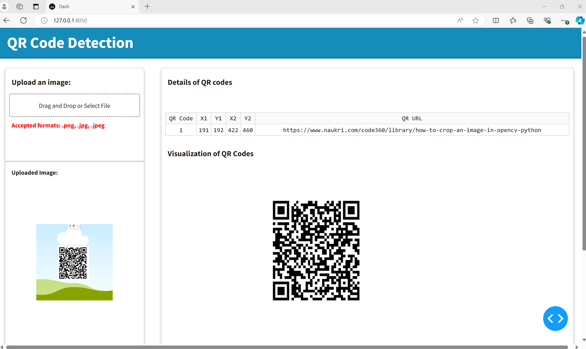

# QR-Code-Detector

In this repository you can find Jupyter Notebooks and Python scripts for training and deploying a Machine Learning model to locate QR codes in an image.

To perform the task of detecting QR codes in an image, a personalized **YOLOv8** model was trained. **YOLOv8** is a real-time object detection and image segmentation model developed by **Ultralytics**. The main advantages of using this model are its high accuracy rate, that it can be trained on a single GPU, and that it comes with a Python package, making the training process more intuitive.

For model training, a custom dataset was used containing images of QR codes with their respective labels indicating their position. The dataset can be found in the following link: *(https://universe.roboflow.com/qr-lmsul/qr-code-detection-jz2e3/dataset/2)*. This dataset was downloaded from the **Roboflow** platform and is composed as follows:

* Train data: 1,083 images
* Validation data: 309 images
* Test data: 155 images

This process was carried out using **Collab** Pro and Python 3 with a Google Compute Engine backend (GPU). In the notebook *Train QR detection model.ipynb*, you can visualize the training process of the YOLOv8 model and the validation of the performance metrics obtained on the training, validation, and test datasets.

The selected model was the one that achieved the best performance metrics during the training process. The following are the final metrics of this model in the validation dataset:

| Precision | mAP50 | mAP50-95 |
|-----------|-------|----------|
| 0.979     | 0.984 | 0.878    |

Subsequently, a web app was created to make the model available using the Python Dash library. The app is visualized below:

Currently, the app runs locally. To use it, follow these steps:

1. Clone this repository using GIT.
2. Create a virtual Python environment.
3. Install the required libraries using the *requirements.txt* file.
4. Install the pyzbar library following the instructions described in this README: https://github.com/NaturalHistoryMuseum/pyzbar. If you are using Windows, you may need **Visual C++ Redistributable Packages for Visual Studio 2013** for the library to work correctly.
5. Run the *app.py* script.

The application allows users to upload an image in *.png*, *.jpg*, *.jpeg* format. Subsequently, a box will be displayed containing the coordinates indicating the location of the detected QR code(s) in the image and their respective URLs. If no QR code is detected in the image, the following message will be displayed: **No QR Code Detected**. Additionally, a process was included in which the image is cropped using the coordinates provided by the model and the QR code is displayed in the application.

